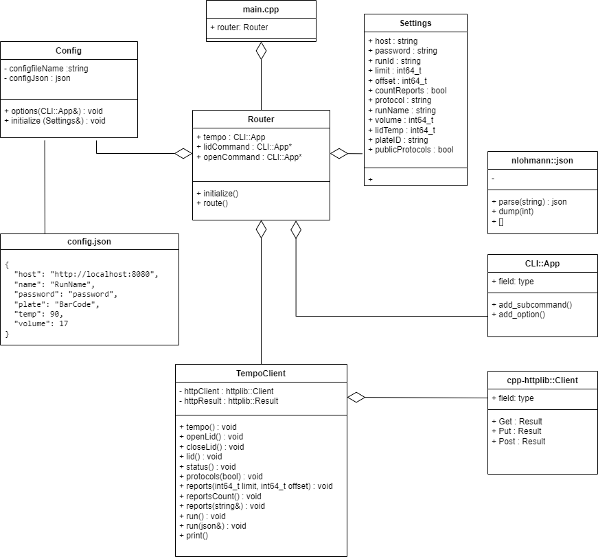

# PTC Tempo Automation API Client Application

<!-- TOC -->
* [PTC Tempo Automation API Client Application](#ptc-tempo-automation-api-client-application)
  * [Overview](#overview)
  * [Build Steps](#build-steps)
    * [Linux or Cygwin](#linux-or-cygwin)
      * [HTTPS Build Option on Linux](#https-build-option-on-linux)
      * [HTTPS Build Option on Cygwin](#https-build-option-on-cygwin)
    * [2019 Visual Studio](#2019-visual-studio)
    * [Visual Studio on Command Line](#visual-studio-on-command-line)
      * [HTTPS Build Option with Visual Studio](#https-build-option-with-visual-studio)
    * [Documentation](#documentation)
  * [Usage](#usage)
    * [Help](#help)
    * [Lid](#lid)
    * [Open Lid](#open-lid)
    * [Close Lid](#close-lid)
    * [Status](#status)
    * [Errors](#errors)
    * [Protocols](#protocols)
    * [Run](#run)
    * [Skip](#skip)
    * [Pause](#pause)
    * [Resume](#resume)
    * [Stop](#stop)
    * [Reports](#reports)
    * [License](#license)
    * [Version](#version)
    * [Config](#config)
  * [Client Application Design](#client-application-design)
<!-- TOC -->

## Overview

The PTC Tempo PCR thermal cycler includes a RESTful Automation API. The PTC Tempo can be controlled from a separate computer, enabling laboratories to automate protocol runs in conjunction with a robotic plate loader. A license key is required to turn on this feature. Contact Bio-Rad sales for more information.

This sample app demonstrates how to use the PTC Tempo Automation API. 

## Build Steps


1. Clone the repo.

2. Initialize the submodules.

This project requires these submodules. You will need to initialize and update the submodules before building. The submodule source repos are in the 3rdParty directory.
+ nlohmann:json
+ cpp-httplib
+ CLI11

Use these commands to init the submodules.
```
> cd PTC_Tempo_Client
> git submodule init
```

The output should look like this.
```
Submodule '3rdParty/CLI11' (https://github.com/CLIUtils/CLI11.git) registered for path '3rdParty/CLI11'
Submodule '3rdParty/cpp-httplib' (https://github.com/yhirose/cpp-httplib.git) registered for path '3rdParty/cpp-httplib'
Submodule '3rdParty/nlohmann/json' (https://github.com/nlohmann/json.git) registered for path '3rdParty/nlohmann/json'
```

3. Update Submodules

After initializing, use this command to update the submodules.
```
> git submodule update
```

The output should look like this.
```
Cloning into '/cygdrive/c/Repos/Client_3/PTC_Tempo_Client/3rdParty/CLI11'...
Cloning into '/cygdrive/c/Repos/Client_3/PTC_Tempo_Client/3rdParty/cpp-httplib'...
Cloning into '/cygdrive/c/Repos/Client_3/PTC_Tempo_Client/3rdParty/nlohmann/json'...
Submodule path '3rdParty/CLI11': checked out '<commit_hash>'
Submodule path '3rdParty/cpp-httplib': checked out '<commit_hash>'
Submodule path '3rdParty/nlohmann/json': checked out '<commit_hash>'
```

### Linux or Cygwin

This is a cmake project in C++. The classes are in header files in the include directory.

These commands will build a release version of the client app using cmake on Linux or Cygwin.
```
> mkdir ../build
> cd ../build
> cmake  ../PTC_Tempo_Client/.
> cmake --build . --target all --config Release
```

The output from the final command should look like this.
```
[ 50%] Building CXX object CMakeFiles/tempoclient.dir/main.cpp.o
[100%] Linking CXX executable tempoclient.exe
[100%] Built target tempoclient
[100%] Built target CLI11
```

You can also use an IDE such as CLion. Open the CMakeLists.txt to build and run the project.

#### HTTPS Build Option on Linux
1. Run this command to install openssl. You might need to run this as root or use sudo.
```
> sudo apt-get install libssl-dev
```
2. Follow steps 2 and 3 in the [HTTPS Build Option with Visual Studio](#HTTPS-Build-Option-with-Visual-Studio) section.
3. Build the application using the commands in [Linux or Cygwin](#Linux-or-Cygwin).

#### HTTPS Build Option on Cygwin
1. Select "OpenSSL" when choosing the packages in the Cygwin installer.
2. Complete the Cygwin setup.
3. Follow steps 2 and 3 in the [HTTPS Build Option with Visual Studio](#HTTPS-Build-Option-with-Visual-Studio) section.
4. Build the application using the commands in [Linux or Cygwin](#Linux-or-Cygwin).

### 2019 Visual Studio
1. From the Visual Studio installer make sure "Desktop development with C++" is installed.
2. In Visual Studio, go to File -> Open.
3. Select the CMakeLists.txt in the PCT_Tempo_Client repository.

### Visual Studio on Command Line
The following commands will build on Windows from the command line if the Visual Studio cmake tool is in your path.
```
> mkdir build
> cd build
> cmake  ..\PTC_Tempo_Client\.
> cmake --build . --target ALL_BUILD --config Release
```

#### HTTPS Build Option with Visual Studio

The tempoclient supports TLS/HTTPS encrypted connections with a CMakeLists build option and an install of OpenSSL.

1. Build a local copy of OpenSSL or install it. If you prefer to build it, you can do that from (the OpenSSL GitHub repo](https://github.com/openssl/openssl). If you intend to install it, you can [download the OpenSSL binaries](https://wiki.openssl.org/index.php/Binaries) and follow the instructions.

2. Turn on the option in the project CMakeLists.txt by changing the USE_OPEN_SSL from 0 to 1.

```
set (USE_OPEN_SSL 1)
```

3. Set the OPENSSL_ROOT_DIR environment variable to the path of the OpenSSL build or install. Make sure your PATH environment variable includes to the OpenSSL bin directory.
```
OPENSSL_ROOT_DIR
PATH
```

4. Reload cmake files and build.

To run the tempoclient.exe on a computer other than a build computer, install the runtime version of OpenSSL and set the path and environment variables.
```
OPENSSL_CONF
PATH
```

### Documentation
The client app source code has Javadoc style comments to describe the functions and classes. You can create documentation for the source code using tools such as doxygen or javadoc.

*Doxygen*

We provided the tempoclient.dox to make it easy to create documentation of the client app.

1. Download the doxygen tool [from here](https://www.doxygen.nl/download.html).
2. Download the graphviz dot tool [from here](https://www.graphviz.org/download/).
3. Install both doxygen and dot.
4. Run this command line in the PTC_Tempo_Client directory.

```
doxygen tempoclient.dox
```

If there are no errors running doxygen, it will place documentation files in the dox/html folder. After creating the documentation, load the dox/html/index.html into a browser.

## Usage
The tempoclient application translates command line options into HTTP RESTful requests to the PTC Tempo Instrument. It also uses a config.json to set default values for many settings used in the application. Refer to the PTC Tempo API Reference Guide on how to start the instrument Automation API.

### Help
The ```--help``` option provides a list of all command line arguments.
```
> ./tempoclient --help
PTC Tempo command line interface to Automation API
Usage: ./tempoclient [OPTIONS] [SUBCOMMAND]

Options:
  -h,--help                   Print this help message and exit
  --host TEXT                 Sets the host string of the instrument. example: http://10.10.2.51
  --password TEXT             Provides password for the Automation user.
  --waitTime INT              Sets how long to wait for a response in seconds.
  --interval INT              Sets polling interval in seconds when monitoring.
  --display TEXT              Sets output display format - options: text or json.

Subcommands:
  lid                         Gets the instrument lid status.
  open                        Opens the instrument lid.
  close                       Closes the instrument lid.
  status                      Gets a brief status of the instrument and currently running protocol.
  errors                      Gets a list of device faults.
  reports                     Gets a list of run reports for the Automation user or retrieves the details of a specific run report.
  protocols                   Lists all protocols present in the Automation user's My Files folder.
  run                         If used without options, it provides run status. If used with --protocol option, it starts a run.
  stop                        Stops the protocol run.
  skip                        Skips the currently active step in the protocol run.
  pause                       Pauses the protocol run.
  resume                      Resumes the protocol run.
  license                     Prints the copyright licenses.
  version                     Prints the tempoclient version and checks the version of the Automation API.
  config                      Sets the default values in config.json.
```

Configure the instrument host string and password.

```
> ./tempoclient config --host http://10.10.2.51 --password ***** 
```

After the host is configured, request for the instrument details is the default command. This means you get the instrument status if you provide no commands or options.

```
> ./tempoclient

{
  "device": {
    "details": {
      "automationAPI": "1.0.0",
...
    },
    "instrumentName": "C2000",
    "model": "PTCTempo384",
    "serialNumber": "CC00622",
    "type": "PTCTempo",
    "ver": "1.2.0 "
  },
  "lid": "closed",
  "status": "idle",
  "time": "2023-04-15T10:43:03-07:00"
}
```

Even if the config.json file stores information for one host, you can still connect to a different host. Just specify the other host's URL on the command line with the ```--host``` option. You might also need to use a different password.

``` 
> ./tempoclient --host https://234.123.98.76:8080 --password peekaboo resume
``` 

Any config options can be used with subcommands that make HTTP requests. Config options on the command line will override the values within the config.json file.
+ --host
+ --password
+ --waitTime
+ --interval
+ --display

### Lid

Gets the instrument's lid status. The ```--monitor``` options causes the client to poll PTC Tempo repeatedly. The ```--interval``` options sets how often in seconds the client app will poll.

```
> ./tempoclient lid --help
Gets the instrument lid status.
Usage: ./tempoclient lid [OPTIONS]

Options:
  -h,--help                   Print this help message and exit
  --monitor                   Monitor lid status.
  --interval INT              Set interval for polling lid status. Requires --monitor flag.
```


### Open Lid

```
> ./tempoclient open
```

The lid status changes to opening until the lid is opened.

```
> ./tempoclient lid
{
  "lid": "opening",
  "status": "opening"
}

> ./tempoclient lid
{
  "lid": "opened",
  "status": "idle"
} 
```

The lid status polling is achieved with the ```--monitor``` flag. Use the ```--interval``` option to set the polling frequency in seconds.

```
> ./tempoclient lid --monitor
{
  "lid": "opening",
  "status": "opening"
}

> ./tempoclient lid --monitor --interval 3
{
  "lid": "opened",
  "status": "idle"
} 
```

Now is the time load a plate manually or with a robotic arm.

### Close Lid

```
> ./tempoclient close
```

### Status

Provides the instrument's current status.

```
> ./tempoclient status --help
Gets a brief status of the instrument and currently running protocol.
Usage: ./tempoclient status [OPTIONS]

Options:
  -h,--help                   Print this help message and exit
  --monitor                   Monitor instrument status.
  --interval INT              Set interval for instrument status refresh. Requires --monitor flag.
```

Example output from status command when no run is active.

```
> ./tempoclient status
{
  "httpCode": 200,
  "status": "idle"
}
```

Example output from status command when a run is active.

```
> ./tempoclient status
{
  "currentRepeat": 1,
  "protocolTimeRemaining": 242,
  "status": "running",
  "stepNumber": 1,
  "totalRepeat": 0
}
```

### Errors

Either returns a list of faults or clears out current faults. These can be either thermal cycler faults or lid faults.

```
> ./tempoclient errors --help
Get list of device faults.
Usage: ./tempoclient errors [OPTIONS]

Options:
  -h,--help                   Print this help message and exit
  --clear                     Clear device faults.
```

Example output showing lists of two thermal cycler faults and one lid fault.

```
> ./tempoclient errors
{
  "cyclerFaultCount": 2,
  "cyclerFaults": [
    {
      "block": 0,
      "description": "Left heatsink over temperature error",
      "info": 0,
      "number": 301,
      "severity": "abort",
      "timestamp": "2023-04-26T11:28:18-07:00"
    },
    {
      "block": 0,
      "description": "Low ramp temperature error",
      "info": 0,
      "number": 311,
      "severity": "abort",
      "timestamp": "2023-04-26T11:28:11-07:00"
    }
  ],
  "httpCode": 200,
  "lidFaultCount": 1,
  "lidFaults": [
    {
      "block": 0,
      "description": "Hinge motor close switch not activated at engage position",
      "info": 0,
      "number": 1015,
      "severity": "abort",
      "timestamp": "2023-04-26T11:28:24-07:00"
    }
  ]
}
```

Example output when faults are cleared.

```
> ./tempoclient errors --clear
{
  "httpCode": 200
}
```

### Protocols

Displays a list of the protocols on the instrument. The protocols command by default displays the protocols present in the Automation user's folder (My Files) on the PTC Tempo. Use the option ```--public``` to list the protocols in the Public folder.


```
> ./tempoclient protocols
{
  "location": "Automation",
  "protocolNames": [
    {
      "lastModified": "2023-04-07T07:28:02",
      "name": "NESTPR2-fast-long"
    }
    {
      "lastModified": "2023-03-18T15:59:51",
      "name": "STD2-short"
    },
  ]
}
```

### Run

If provided without any options, it gets the current run status. If provided with --protocol option, then it starts a run. All the other options are only used when starting a run. The runName and plateID are automatically generated if the ```--name``` and ```--plate``` options are not provided when starting a run. (Note: The names used in this example are not a recommendation for any use case.)

```
> ./tempoclient run --help
Usage: ./tempoclient run [OPTIONS]

Options:
  -h,--help                   Print this help message and exit.
  --protocol TEXT             Name of the protocol to run.
  --name TEXT                 Name for the run. Requires the --protocol option.
  --plate TEXT                ID of the plate used in the run. Requires the --protocol option.
  --volume INT                Volume for the run. Requires the --protocol option.
  --temp INT                  Lid temperature for the run. Requires the --protocol option.
  --public                    Use protocol in the public folder. Requires the --protocol option.
  --templates                 Use a template protocol. Requires the --protocol option.
  --monitor                   Monitor run status. Requires the --protocol option.
  --interval INT              Sets polling interval in seconds when monitoring. Requires the --monitor flag.
```

Example for starting a new run using STD2-short protocol.

``` 
> ./tempoclient run --protocol STD2-short
{
  "lid": "opened",
  "lidTemp": 90,
  "status": "running",
  "steps": 6,
  "time": "2023-04-16T12:02:08-07:00",
  "volume": 17
}
> ./tempoclient run
{
  "lid": "closing",
  "status": "closing",
  "time": "2023-04-16T12:02:12-07:00"
}
```

The run status is provided by using the run command or status command. Example output when no run is active.

```
> ./tempoclient run
{
  "lid": "closing",
  "status": "closing",
  "time": "2023-04-16T12:02:15-07:00"
}
```

Example output when a run is active.

```
> ./tempoclient run
{
  "lid": "closedWithPlate",
  "protocolRun": {
    "block": 0,
    "lidTemp": 90,
    "plateID": "plate8446",
    "protocolName": "STD2-short",
    "runName": "runSTD2-short8446",
    "step": {
      "currentRepeat": 1,
      "numberOfSteps": 6,
      "stepNumber": 1,
      "stepState": "lidPreheat",
      "stepTime": 0,
      "totalRepeat": 0
    },
    "temperature": {
      "currentBlockTemp": 25.1,
      "currentLidTemp": 50.1,
      "currentSampleTemp": 25.1
    },
    "time": {
      "elapsed": 0,
      "hold": 0,
      "remaining": 0,
      "totalRemaining": 242
    },
    "volume": 17
  },
  "status": "running",
  "time": "2023-04-16T12:02:20-07:00"
}
```

Example output from status command when a run is active.

```
> ./tempoclient status
{
  "currentRepeat": 1,
  "protocolTimeRemaining": 242,
  "status": "running",
  "stepNumber": 1,
  "totalRepeat": 0
}

```

The run status polling is achieved with the run command or status command using the ```--monitor``` flag. Use the ```--interval``` option to set polling frequency in seconds.

```

> ./tempoclient run --monitor
{
  "lid": "closing",
  "status": "closing",
  "time": "2023-04-16T12:02:15-07:00"
}

> ./tempoclient run --monitor --interval 3
{
  "lid": "closing",
  "status": "closing",
  "time": "2023-04-16T12:02:15-07:00"
}

> ./tempoclient status --monitor
{
  "currentRepeat": 1,
  "protocolTimeRemaining": 242,
  "status": "running",
  "stepNumber": 1,
  "totalRepeat": 0
}

> ./tempoclient status --monitor --interval 3
{
  "currentRepeat": 1,
  "protocolTimeRemaining": 242,
  "status": "running",
  "stepNumber": 1,
  "totalRepeat": 0
}

```

From the "protocolTimeRemaining" in seconds, a client application can calculate when the run is finished. With polling, the run is finished with the "status" of "idle" again unless an "error" occurs.

### Skip

Skips over the current step in active run. This will return 200 status code for success, or 400 if no protocol is currently running.

```
> ./tempoclient skip --help
Skip currently active step in the protocol run.
Usage: tempoclient skip [OPTIONS]

Options:
  -h,--help                   Print this help message and exit
```

### Pause

Pauses the current run. This will return 200 status code for success, or 400 if no protocol is currently running.

```
> ./tempoclient pause --help
Pauses the protocol run.
Usage: tempoclient pause [OPTIONS]

Options:
  -h,--help                   Print this help message and exit
```

### Resume

Resumes a paused protocol run. This will return 200 status code for success, or 400 if no protocol is currently paused.

```
> ./tempoclient resume --help
Resumes the protocol run.
Usage: tempoclient resume [OPTIONS]

Options:
  -h,--help                   Print this help message and exit
```

### Stop

Stops the protocol run. This will return 200 status code for success, or 400 if no protocol is actively running.

```
> ./tempoclient stop --help
Stops the protocol run.
Usage: tempoclient stop [OPTIONS]

Options:
  -h,--help                   Print this help message and exit
```

### Reports

This command has several modes.
+ Lists all reports if used with no options. The list is always sorted from most recent to oldest.
+ Provides a count of how many reports if used with the ```--count``` option.
+ Provides a specific report if used with the ```--id``` option.
+ Provides a list of some reports if used with the ```--limit``` or ```--offset``` options.

```
> ./tempoclient reports --help
List and get report request.
Usage: ./tempoclient reports [OPTIONS]

Options:
  -h,--help                   Print this help message and exit.
  --id TEXT                   Run id of the report to retrieve.
  --limit INT                 Number of reports to retrieve.
  --offset INT                Offset at which to start retrieving the list of reports.
  --count                     Returns the total count of reports.
```

### License

Prints out license information for the client app and third-party open-source libraries.

```
> ./tempoclient license
```


### Version

Prints the versions and checks the Automation API compatibility.
```
> .\tempoclient version
{
  "automationAPI": "1.0.0",
  "httpCode": 200,
  "version": "1.0.0"
}
```

An incompatible error appears, if the Automation API major version is greater than the app version. The exit code is 1.
```
> .\tempoclient version
{
  "automationAPI": "2.0.0",
  "error": "incompatible",
  "httpCode": 200,
  "version": "1.0.0"
}
```

If the instrument is unavailable, the exit code is not equal to zero and the http code is 504.
```
> .\tempoclient.exe  version
HTTP client error: Could not establish connection
{
  "httpCode": 504,
  "version": "1.0.0"
}
```

### Config

Sets default values in config.json based on the OPTIONS provided. The config.json file is stored in the working directory of the tempoclient.

Help information provided on setting default values in the config.json file.
```
> ./tempoclient config --help
Set default values in config.json.
Usage: ./tempoclient config [OPTIONS]

Options:
  -h,--help                   Print this help message and exit.
  --host TEXT                 Set the Host URL and provide the IP address of the PTC Tempo thermal cycler.
  --password TEXT             Password for the Automation user on the PTC Tempo thermal cycler.
  --display TEXT              Sets output display format - options: text or json.
  --interval INT              Sets polling interval in seconds when monitoring.
  --waitTime INT              Sets how long to wait for a response in seconds.
```


Use the ```---interval``` option to set the polling interval for monitoring run and lid status.

```
> ./tempoclient config --interval 3

{
  "host": "http://192.168.1.132",
  "password": "pswd",
  "interval": 3
}
```

Use the ```--display``` option to set the response display type. Possible inputs are "text" and "json".

```
> ./tempoclient config --display json

{
  "host": "http://192.168.1.132",
  "password": "pswd",
  "interval": 3
  "display": "json"
}
```

## Client Application Design

The client application utilizes the following classes:

* **Router** - used by the main function to control routing the command and options to a REST Automation API request.
* **Config** - reads the config.json and sets the default values in the Settings before they are changed by any options on the command line.
* **Settings** - Structure holds all the command line option values for the application.
* **TempoClient** - Utilizes the cpp-httplib to make HTTP requests to the instrument.

The class source is all in header files like the libraries that it utilizes.
The source does not use a prefix for member variables like 'm_'.


